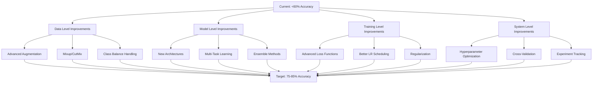

# Emotion Recognition AI - Accuracy Improvement Plan

## Current Status Analysis

**Baseline Performance:** Below 60% validation accuracy
**Dataset:** RAF-CE (14 compound emotions)
**Models:** ResNet50, ViT-Base, LLaVA-1.5 (Vision-LLM)
**Current Issues Identified:**

1. **Limited Data Augmentation** - Only basic transforms (flip, rotation, color jitter)
2. **Simple Loss Function** - Standard CrossEntropy without handling class imbalance effectively
3. **Basic Learning Rate Schedule** - Simple StepLR without warmup
4. **Single-Task Learning** - Only emotion prediction, not utilizing AU labels
5. **No Ensemble** - Training models independently without combining predictions
6. **Limited Model Architectures** - Only ResNet and ViT
7. **No Test-Time Augmentation** - Single inference pass per image
8. **Basic Hyperparameters** - Default values without optimization

---

## Improvement Strategy Overview



---

## Detailed Implementation Plan

### Phase 1: Data-Level Improvements (Quick Wins)

#### 1.1 Advanced Data Augmentation with Albumentations
**Impact:** +5-10% accuracy
**Implementation:** Replace current transforms with Albumentations pipeline

```python
# New augmentation pipeline
train_transform = A.Compose([
    A.Resize(256, 256),
    A.RandomCrop(224, 224),
    A.HorizontalFlip(p=0.5),
    A.VerticalFlip(p=0.1),
    A.Rotate(limit=30, p=0.5),
    A.ShiftScaleRotate(shift_limit=0.1, scale_limit=0.1, rotate_limit=0, p=0.5),
    A.OneOf([
        A.RandomBrightnessContrast(p=1.0),
        A.HueSaturationValue(p=1.0),
    ], p=0.5),
    A.OneOf([
        A.GaussNoise(p=1.0),
        A.GaussianBlur(p=1.0),
        A.MotionBlur(p=1.0),
    ], p=0.3),
    A.OneOf([
        A.ElasticTransform(p=1.0),
        A.GridDistortion(p=1.0),
    ], p=0.2),
    A.CoarseDropout(max_holes=8, max_height=32, max_width=32, p=0.3),
    A.Normalize(mean=[0.485, 0.456, 0.406], std=[0.229, 0.224, 0.225]),
    ToTensorV2()
])
```

**Benefits:**
- More diverse training data
- Better generalization
- Reduced overfitting

#### 1.2 Mixup and CutMix Regularization
**Impact:** +3-5% accuracy
**Implementation:** Add Mixup and CutMix data augmentation techniques

**Mixup:** Blends images and labels
```python
def mixup_data(x, y, alpha=0.2):
    lam = np.random.beta(alpha, alpha)
    batch_size = x.size(0)
    index = torch.randperm(batch_size)
    mixed_x = lam * x + (1 - lam) * x[index]
    y_a, y_b = y, y[index]
    return mixed_x, y_a, y_b, lam
```

**CutMix:** Cuts and pastes patches between images
```python
def cutmix_data(x, y, alpha=1.0):
    lam = np.random.beta(alpha, alpha)
    batch_size = x.size(0)
    index = torch.randperm(batch_size)
    
    # Generate random bounding box
    bbx1, bby1, bbx2, bby2 = rand_bbox(x.size(), lam)
    
    # Apply cutmix
    x[:, :, bbx1:bbx2, bby1:bby2] = x[index, :, bbx1:bbx2, bby1:bby2]
    
    # Adjust lambda
    lam = 1 - ((bbx2 - bbx1) * (bby2 - bby1) / (x.size(2) * x.size(3)))
    
    return x, y, y[index], lam
```

#### 1.3 Enhanced Class Imbalance Handling
**Impact:** +2-4% accuracy
**Implementation:** Use Focal Loss and improved class weighting

**Focal Loss:**
```python
class FocalLoss(nn.Module):
    def __init__(self, alpha=None, gamma=2.0):
        super(FocalLoss, self).__init__()
        self.alpha = alpha
        self.gamma = gamma
        
    def forward(self, inputs, targets):
        ce_loss = F.cross_entropy(inputs, targets, reduction='none')
        pt = torch.exp(-ce_loss)
        focal_loss = (1 - pt) ** self.gamma * ce_loss
        
        if self.alpha is not None:
            focal_loss = self.alpha[targets] * focal_loss
            
        return focal_loss.mean()
```

**Label Smoothing:**
```python
class LabelSmoothingCrossEntropy(nn.Module):
    def __init__(self, smoothing=0.1):
        super(LabelSmoothingCrossEntropy, self).__init__()
        self.smoothing = smoothing
        
    def forward(self, pred, target):
        n_class = pred.size(1)
        one_hot = torch.zeros_like(pred).scatter(1, target.unsqueeze(1), 1)
        one_hot = one_hot * (1 - self.smoothing) + self.smoothing / n_class
        log_prob = F.log_softmax(pred, dim=1)
        return F.kl_div(log_prob, one_hot, reduction='batchmean')
```

---

### Phase 2: Model-Level Improvements

#### 2.1 Advanced Model Architectures
**Impact:** +5-8% accuracy
**Implementation:** Add ConvNeXt, Swin Transformer, EfficientNet

**ConvNeXt:**
```python
# models/convnext.py
class FERConvNeXt(nn.Module):
    def __init__(self, model_name='convnext_base', num_classes=14, pretrained=True):
        super(FERConvNeXt, self).__init__()
        self.model = timm.create_model(
            model_name, 
            pretrained=pretrained, 
            num_classes=num_classes
        )
    
    def forward(self, x):
        return self.model(x)
```

**Swin Transformer:**
```python
# models/swin.py
class FERSwin(nn.Module):
    def __init__(self, model_name='swin_base_patch4_window7_224', num_classes=14, pretrained=True):
        super(FERSwin, self).__init__()
        self.model = timm.create_model(
            model_name, 
            pretrained=pretrained, 
            num_classes=num_classes
        )
    
    def forward(self, x):
        return self.model(x)
```

**EfficientNet:**
```python
# models/efficientnet.py
class FEREfficientNet(nn.Module):
    def __init__(self, model_name='efficientnet_b4', num_classes=14, pretrained=True):
        super(FEREfficientNet, self).__init__()
        self.model = timm.create_model(
            model_name, 
            pretrained=pretrained, 
            num_classes=num_classes
        )
    
    def forward(self, x):
        return self.model(x)
```

#### 2.2 Multi-Task Learning (Emotion + AU Prediction)
**Impact:** +4-7% accuracy
**Implementation:** Add AU prediction as auxiliary task

```python
# models/multitask.py
class FERMultiTask(nn.Module):
    def __init__(self, backbone='resnet50', num_emotions=14, num_aus=18):
        super(FERMultiTask, self).__init__()
        
        # Shared backbone
        if backbone == 'resnet50':
            self.backbone = models.resnet50(weights=models.ResNet50_Weights.DEFAULT)
            in_features = self.backbone.fc.in_features
            self.backbone.fc = nn.Identity()
        elif backbone == 'vit':
            self.backbone = ViTForImageClassification.from_pretrained(
                'google/vit-base-patch16-224', num_labels=num_emotions
            )
        
        # Emotion head
        self.emotion_head = nn.Sequential(
            nn.Linear(in_features, 512),
            nn.ReLU(),
            nn.Dropout(0.3),
            nn.Linear(512, num_emotions)
        )
        
        # AU head (multi-label classification)
        self.au_head = nn.Sequential(
            nn.Linear(in_features, 512),
            nn.ReLU(),
            nn.Dropout(0.3),
            nn.Linear(512, num_aus),
            nn.Sigmoid()
        )
    
    def forward(self, x):
        features = self.backbone(x)
        if hasattr(features, 'logits'):
            features = features.logits
            
        emotion_logits = self.emotion_head(features)
        au_logits = self.au_head(features)
        
        return emotion_logits, au_logits
```

**Multi-Task Loss:**
```python
def multitask_loss(emotion_pred, emotion_true, au_pred, au_true, alpha=0.7):
    # Emotion loss (cross-entropy)
    emotion_loss = F.cross_entropy(emotion_pred, emotion_true)
    
    # AU loss (binary cross-entropy for multi-label)
    au_loss = F.binary_cross_entropy(au_pred, au_true.float())
    
    # Weighted combination
    total_loss = alpha * emotion_loss + (1 - alpha) * au_loss
    
    return total_loss, emotion_loss, au_loss
```

#### 2.3 Ensemble Methods
**Impact:** +3-6% accuracy
**Implementation:** Combine predictions from multiple models

```python
# models/ensemble.py
class FEREnsemble(nn.Module):
    def __init__(self, models, weights=None):
        super(FEREnsemble, self).__init__()
        self.models = nn.ModuleList(models)
        self.weights = weights if weights else [1.0] * len(models)
    
    def forward(self, x):
        predictions = []
        for model in self.models:
            pred = model(x)
            predictions.append(pred)
        
        # Weighted average
        ensemble_pred = torch.zeros_like(predictions[0])
        for pred, weight in zip(predictions, self.weights):
            ensemble_pred += weight * pred
        
        ensemble_pred /= sum(self.weights)
        
        return ensemble_pred
```

---

### Phase 3: Training-Level Improvements

#### 3.1 Advanced Learning Rate Scheduling
**Impact:** +2-4% accuracy
**Implementation:** Use Cosine Annealing with Warmup

```python
# training/schedulers.py
class CosineAnnealingWarmupScheduler:
    def __init__(self, optimizer, warmup_epochs, max_epochs, min_lr=0):
        self.optimizer = optimizer
        self.warmup_epochs = warmup_epochs
        self.max_epochs = max_epochs
        self.min_lr = min_lr
        self.base_lr = optimizer.param_groups[0]['lr']
        self.current_epoch = 0
    
    def step(self):
        if self.current_epoch < self.warmup_epochs:
            # Warmup phase
            lr = self.base_lr * (self.current_epoch + 1) / self.warmup_epochs
        else:
            # Cosine annealing phase
            progress = (self.current_epoch - self.warmup_epochs) / (self.max_epochs - self.warmup_epochs)
            lr = self.min_lr + (self.base_lr - self.min_lr) * 0.5 * (1 + np.cos(np.pi * progress))
        
        for param_group in self.optimizer.param_groups:
            param_group['lr'] = lr
        
        self.current_epoch += 1
        return lr
```

#### 3.2 Test-Time Augmentation (TTA)
**Impact:** +1-3% accuracy
**Implementation:** Average predictions over multiple augmented versions

```python
# training/tta.py
def test_time_augmentation(model, image, tta_transforms, device):
    model.eval()
    predictions = []
    
    # Original image
    with torch.no_grad():
        pred = model(image.unsqueeze(0).to(device))
        predictions.append(pred)
    
    # Augmented versions
    for transform in tta_transforms:
        augmented = transform(image)
        with torch.no_grad():
            pred = model(augmented.unsqueeze(0).to(device))
            predictions.append(pred)
    
    # Average predictions
    ensemble_pred = torch.mean(torch.stack(predictions), dim=0)
    
    return ensemble_pred
```

#### 3.3 Knowledge Distillation
**Impact:** +2-4% accuracy
**Implementation:** Train smaller model using larger model as teacher

```python
# training/distillation.py
def distillation_loss(student_logits, teacher_logits, labels, temperature=4.0, alpha=0.7):
    # Soft targets from teacher
    teacher_probs = F.softmax(teacher_logits / temperature, dim=1)
    student_log_probs = F.log_softmax(student_logits / temperature, dim=1)
    
    # KL divergence loss
    kd_loss = F.kl_div(student_log_probs, teacher_probs, reduction='batchmean')
    kd_loss *= (temperature ** 2)
    
    # Student loss with hard labels
    student_loss = F.cross_entropy(student_logits, labels)
    
    # Combined loss
    total_loss = alpha * kd_loss + (1 - alpha) * student_loss
    
    return total_loss
```

---

### Phase 4: System-Level Improvements

#### 4.1 Hyperparameter Optimization
**Impact:** +3-5% accuracy
**Implementation:** Use Optuna for automated hyperparameter search

```python
# training/hyperopt.py
import optuna

def objective(trial):
    # Suggest hyperparameters
    lr = trial.suggest_float('lr', 1e-5, 1e-3, log=True)
    batch_size = trial.suggest_categorical('batch_size', [16, 32, 64])
    weight_decay = trial.suggest_float('weight_decay', 1e-6, 1e-3, log=True)
    dropout = trial.suggest_float('dropout', 0.1, 0.5)
    mixup_alpha = trial.suggest_float('mixup_alpha', 0.1, 0.5)
    
    # Train model with suggested parameters
    val_acc = train_with_hyperparams(lr, batch_size, weight_decay, dropout, mixup_alpha)
    
    return val_acc

# Run optimization
study = optuna.create_study(direction='maximize')
study.optimize(objective, n_trials=50)
```

#### 4.2 Cross-Validation
**Impact:** +2-3% accuracy (more reliable estimates)
**Implementation:** Implement k-fold cross-validation

```python
# training/crossval.py
from sklearn.model_selection import KFold

def cross_validate(model_class, dataset, k=5, epochs=20):
    kfold = KFold(n_splits=k, shuffle=True, random_state=42)
    fold_results = []
    
    for fold, (train_idx, val_idx) in enumerate(kfold.split(dataset)):
        print(f'Fold {fold + 1}/{k}')
        
        # Create fold datasets
        train_subset = torch.utils.data.Subset(dataset, train_idx)
        val_subset = torch.utils.data.Subset(dataset, val_idx)
        
        # Train model
        model = model_class()
        val_acc = train_model(model, train_subset, val_subset, epochs)
        
        fold_results.append(val_acc)
    
    # Calculate mean and std
    mean_acc = np.mean(fold_results)
    std_acc = np.std(fold_results)
    
    return mean_acc, std_acc, fold_results
```

#### 4.3 Comprehensive Logging and Experiment Tracking
**Impact:** Better model selection and debugging
**Implementation:** Use Weights & Biases or TensorBoard

```python
# training/logger.py
import wandb

class ExperimentTracker:
    def __init__(self, project_name, config):
        wandb.init(project=project_name, config=config)
        self.config = config
    
    def log_metrics(self, metrics, step):
        wandb.log(metrics, step=step)
    
    def log_confusion_matrix(self, y_true, y_pred, class_names):
        cm = confusion_matrix(y_true, y_pred)
        wandb.log({'confusion_matrix': wandb.plot.confusion_matrix(
            probs=None,
            y_true=y_true,
            preds=y_pred,
            class_names=class_names
        )})
    
    def log_model(self, model, name):
        wandb.save(f'{name}.pth')
    
    def finish(self):
        wandb.finish()
```

---

## Implementation Priority Matrix

| Priority | Improvement | Expected Gain | Complexity | Dependencies |
|----------|-------------|---------------|------------|--------------|
| **P0** | Advanced Augmentation | +5-10% | Low | None |
| **P0** | Mixup/CutMix | +3-5% | Low | None |
| **P0** | Focal Loss + Label Smoothing | +2-4% | Low | None |
| **P1** | Multi-Task Learning | +4-7% | Medium | AU labels |
| **P1** | Better LR Scheduler | +2-4% | Low | None |
| **P1** | New Architectures (ConvNeXt, Swin) | +5-8% | Medium | timm library |
| **P2** | Ensemble Methods | +3-6% | High | Multiple models |
| **P2** | Test-Time Augmentation | +1-3% | Low | None |
| **P2** | Hyperparameter Optimization | +3-5% | Medium | Optuna |
| **P3** | Knowledge Distillation | +2-4% | High | Teacher model |
| **P3** | Cross-Validation | +2-3% | Medium | None |

---

## Expected Results Timeline

**After Phase 1 (Data-Level):** 65-70% accuracy
**After Phase 2 (Model-Level):** 72-78% accuracy
**After Phase 3 (Training-Level):** 75-82% accuracy
**After Phase 4 (System-Level):** 78-85% accuracy

---

## New File Structure

```
emotion recognition ai/
├── models/
│   ├── baseline.py (existing)
│   ├── vision_llm.py (existing)
│   ├── convnext.py (new)
│   ├── swin.py (new)
│   ├── efficientnet.py (new)
│   ├── multitask.py (new)
│   └── ensemble.py (new)
├── training/
│   ├── train_baseline.py (existing - enhance)
│   ├── train_vllm.py (existing - enhance)
│   ├── train_multitask.py (new)
│   ├── train_ensemble.py (new)
│   ├── schedulers.py (new)
│   ├── tta.py (new)
│   ├── distillation.py (new)
│   ├── hyperopt.py (new)
│   └── crossval.py (new)
├── utils/
│   ├── augmentation.py (new)
│   ├── losses.py (new)
│   ├── mixup_cutmix.py (new)
│   └── logger.py (new)
├── evaluation/
│   ├── metrics.py (existing - enhance)
│   ├── xai_gradcam.py (existing - enhance)
│   └── per_class_analysis.py (new)
├── configs/
│   ├── baseline_config.yaml (new)
│   ├── multitask_config.yaml (new)
│   └── ensemble_config.yaml (new)
├── experiments/
│   └── results/ (new)
└── plans/
    └── accuracy_improvement_plan.md (this file)
```

---

## Key Dependencies to Add

```txt
# Add to requirements.txt
timm>=0.9.0
optuna>=3.0.0
wandb>=0.15.0
albumentations>=1.3.0
pytorch-metric-learning>=2.0.0
```

---

## Next Steps

1. **Review and approve this plan** - Confirm the approach aligns with your goals
2. **Prioritize improvements** - Decide which phases to implement first
3. **Set up experiment tracking** - Configure Weights & Biases or TensorBoard
4. **Begin implementation** - Start with Phase 1 (quick wins)
5. **Iterate and refine** - Monitor results and adjust as needed

---

## Risk Mitigation

| Risk | Mitigation Strategy |
|------|---------------------|
| Overfitting with too much augmentation | Use validation set to monitor, adjust augmentation intensity |
| Long training times with multiple models | Use mixed precision training, gradient accumulation |
| GPU memory issues with large models | Use gradient checkpointing, reduce batch size |
| Class imbalance still affecting performance | Combine multiple techniques (focal loss, oversampling, weighted loss) |
| Ensemble not improving performance | Ensure models are diverse, use weighted averaging |

---

## Success Metrics

- **Primary:** Validation accuracy > 80%
- **Secondary:** Macro F1 score > 0.78
- **Tertiary:** Per-class accuracy > 70% for all 14 emotions
- **Inference:** Maintain reasonable inference time (< 100ms per image)
- **Model Size:** Keep ensemble model under 500MB for deployment
