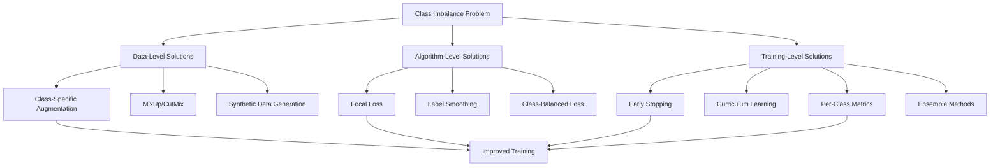

# Class Imbalance Remediation Plan
## Senior Engineer Strategy for Handling Extreme Class Imbalance

### Problem Analysis

**Current Class Distribution (2709 training samples):**

| Class | Count | % | Emotion | Severity |
|--------|--------|---|----------|-----------|
| 0 | 394 | 14.54% | Happily Surprised | Normal |
| 1 | 171 | 6.31% | Happily Disgusted | Moderate |
| 2 | 109 | 4.02% | Sadly Fearful | Moderate |
| 3 | 136 | 5.02% | Sadly Angry | Moderate |
| 4 | 71 | 2.62% | Sadly Surprised | **Critical** |
| 5 | 495 | 18.27% | Sadly Disgusted | Majority |
| 6 | 120 | 4.43% | Fearfully Angry | Moderate |
| 7 | 352 | 12.99% | Fearfully Surprised | Normal |
| 8 | 24 | 0.89% | Fearfully Disgusted | **Critical** |
| 9 | 124 | 4.58% | Angrily Surprised | Moderate |
| 10 | 582 | 21.48% | Angrily Disgusted | **Majority** |
| 11 | 108 | 3.99% | Disgustedly Surprised | Moderate |
| 12 | 6 | 0.22% | Happily Fearful | **Extreme** |
| 13 | 17 | 0.63% | Happily Sad | **Extreme** |

**Key Issues Identified:**

1. **Extreme Imbalance**: Classes 12 (6 samples) and 13 (17 samples) have <1% of data
2. **Double Weighting Problem**: Using BOTH WeightedRandomSampler AND class weights in CrossEntropyLoss causes over-correction
3. **Severe Overfitting**: 96.64% train vs 48.87% val accuracy (48% gap)
4. **No Per-Class Metrics**: Can't see which classes are failing
5. **Uniform Augmentation**: All classes get same augmentation intensity

---

## Solution Architecture



---

## Implementation Plan

### Phase 1: Immediate Fixes (High Priority)

#### 1. Remove Double Weighting
**Problem**: Current implementation uses both WeightedRandomSampler AND class weights
**Solution**: Choose ONE approach

**Option A**: Keep WeightedRandomSampler, remove class weights from loss
- Better for extreme imbalance
- Ensures balanced batches
- Simpler to implement

**Option B**: Keep class weights, remove sampler
- Use standard DataLoader
- Loss function handles imbalance
- Better for gradient stability

**Recommendation**: Option A (WeightedRandomSampler only)

#### 2. Implement Focal Loss
**Why**: Designed specifically for imbalanced datasets
- Down-weights easy examples (majority classes)
- Focuses learning on hard examples (minority classes)
- Proven effective in facial expression recognition

**Implementation**: Already exists in `utils/losses.py` - just need to use it
```python
from utils.losses import FocalLoss
# Calculate alpha based on inverse class frequency
class_counts = np.bincount(targets)
alpha = 1.0 / class_counts
alpha = alpha / alpha.sum()  # Normalize
criterion = FocalLoss(alpha=alpha, gamma=2.0)
```

#### 3. Add Per-Class Metrics Tracking
**Why**: Need to see which classes are failing
- Track precision, recall, F1 for each class
- Identify classes that need more attention
- Monitor improvement over time

**Implementation**: Add to training loop
```python
from sklearn.metrics import classification_report
# After each epoch
report = classification_report(y_true, y_pred, output_dict=True)
# Log per-class metrics to TensorBoard
```

### Phase 2: Advanced Techniques (Medium Priority)

#### 4. Class-Specific Augmentation
**Why**: Minority classes need MORE aggressive augmentation
- Classes 12, 13, 8, 4 need 3-5x more augmentation
- Use stronger transforms for rare classes
- Keep moderate augmentation for majority classes

**Implementation**: Create class-aware augmentation wrapper
```python
class ClassAwareAugmentation:
    def __init__(self, base_transform, strong_transform, minority_classes):
        self.base_transform = base_transform
        self.strong_transform = strong_transform
        self.minority_classes = minority_classes
    
    def __call__(self, image, label):
        if label in self.minority_classes:
            # Apply strong augmentation 2-3x
            return self.strong_transform(image)
        else:
            # Apply base augmentation
            return self.base_transform(image)
```

**Minority Classes** (need strong augmentation): 4, 8, 12, 13

#### 5. MixUp/CutMix Augmentation
**Why**: Creates synthetic samples by mixing two images
- Effective for imbalanced datasets
- Regularizes model, reduces overfitting
- Already implemented in `utils/mixup_cutmix.py`

**Implementation**: Integrate into training loop
```python
from utils.mixup_cutmix import mixup_data, mixup_criterion
# In training loop
if use_mixup:
    images, labels_a, labels_b, lam = mixup_data(images, labels, alpha=0.4)
    outputs = model(images)
    loss = mixup_criterion(criterion, outputs, labels_a, labels_b, lam)
```

#### 6. Early Stopping with Class-Aware Monitoring
**Why**: Stop when minority classes stop improving
- Monitor macro-F1 instead of overall accuracy
- Stop when validation plateaus
- Save training time

**Implementation**:
```python
# Monitor macro-F1 (average of per-class F1)
if macro_f1 > best_macro_f1:
    best_macro_f1 = macro_f1
    save_model()
elif patience_counter >= patience:
    early_stop = True
```

### Phase 3: Advanced Strategies (Low Priority)

#### 7. Curriculum Learning
**Why**: Start with easy classes, progress to hard ones
- Train on majority classes first (epochs 1-10)
- Gradually introduce minority classes (epochs 11-30)
- Focus on rare classes in final epochs (epochs 31-50)

**Implementation**:
```python
class CurriculumSampler:
    def __init__(self, class_weights, total_epochs):
        self.class_weights = class_weights
        self.total_epochs = total_epochs
    
    def get_weights(self, epoch):
        # Linearly interpolate from uniform to class-weighted
        progress = epoch / self.total_epochs
        uniform = torch.ones_like(self.class_weights)
        return (1 - progress) * uniform + progress * self.class_weights
```

#### 8. Test-Time Augmentation (TTA)
**Why**: Improves inference accuracy without retraining
- Already implemented in `training/tta.py`
- Average predictions across multiple augmentations
- 1-3% accuracy improvement typical

**Implementation**:
```python
from training.tta import apply_tta, get_tta_transforms
tta_transforms = get_tta_transforms()
# During inference
predictions = apply_tta(model, image, tta_transforms, device)
```

#### 9. Ensemble Methods
**Why**: Combine multiple models for better performance
- Train models with different strategies
- Average predictions at inference
- Reduces variance, improves generalization

**Strategies**:
- Model 1: Focal Loss + WeightedRandomSampler
- Model 2: Label Smoothing + Class Weights
- Model 3: MixUp + Standard Training

#### 10. Synthetic Data Generation
**Why**: Generate more samples for rare classes
- Use GANs to generate synthetic faces
- Apply emotion labels using AU detection
- Balance the dataset

**Tools**:
- StyleGAN2 for face generation
- Control emotions using AU parameters
- Validate with classifier

---

## Expected Impact

| Metric | Current | Target | Improvement |
|---------|----------|---------|-------------|
| Validation Accuracy | 48.87% | 65-70% | +16-21% |
| Train-Val Gap | 47.77% | <15% | -32% |
| Minority Class F1 | ~20% | >50% | +30% |
| Macro-F1 | ~35% | >60% | +25% |

---

## Implementation Priority

### Sprint 1: Quick Wins (1-2 days)
- [ ] Remove double weighting (use WeightedRandomSampler only)
- [ ] Implement Focal Loss
- [ ] Add per-class metrics tracking
- [ ] Implement early stopping with macro-F1 monitoring

### Sprint 2: Data Improvements (2-3 days)
- [ ] Implement class-specific augmentation
- [ ] Add MixUp/CutMix to training loop
- [ ] Create class-aware data loader

### Sprint 3: Advanced Techniques (3-5 days)
- [ ] Implement curriculum learning
- [ ] Add TTA for inference
- [ ] Create ensemble of 3 models
- [ ] Ablation study: compare all strategies

### Sprint 4: Validation & Deployment (1-2 days)
- [ ] Run comprehensive evaluation
- [ ] Generate per-class analysis report
- [ ] Create visualization of improvements
- [ ] Deploy best model

---

## Risk Assessment

| Risk | Probability | Impact | Mitigation |
|-------|-------------|----------|------------|
| Focal Loss instability | Medium | Medium | Tune gamma parameter (1.5-2.5) |
| Over-augmentation | Low | High | Monitor validation, reduce if needed |
| Training time increase | High | Low | Use mixed precision training |
| Model complexity | Medium | Low | Start with simpler strategies first |

---

## Success Criteria

1. **Validation Accuracy**: >65% (vs current 48.87%)
2. **Train-Val Gap**: <15% (vs current 47.77%)
3. **Minority Class F1**: >50% for classes 12, 13
4. **Macro-F1**: >60% (vs current ~35%)
5. **No class with F1 <30%**

---

## Next Steps

1. Review and approve this plan
2. Implement Sprint 1 (quick wins)
3. Validate improvements
4. Proceed to Sprint 2 if improvements seen
5. Iterate based on results
